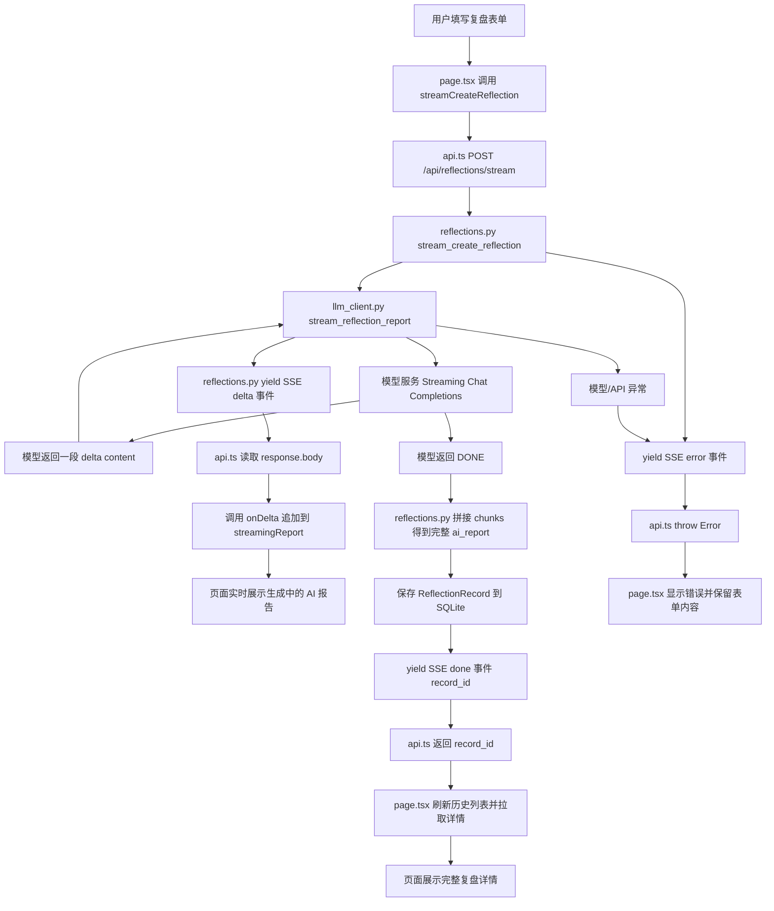
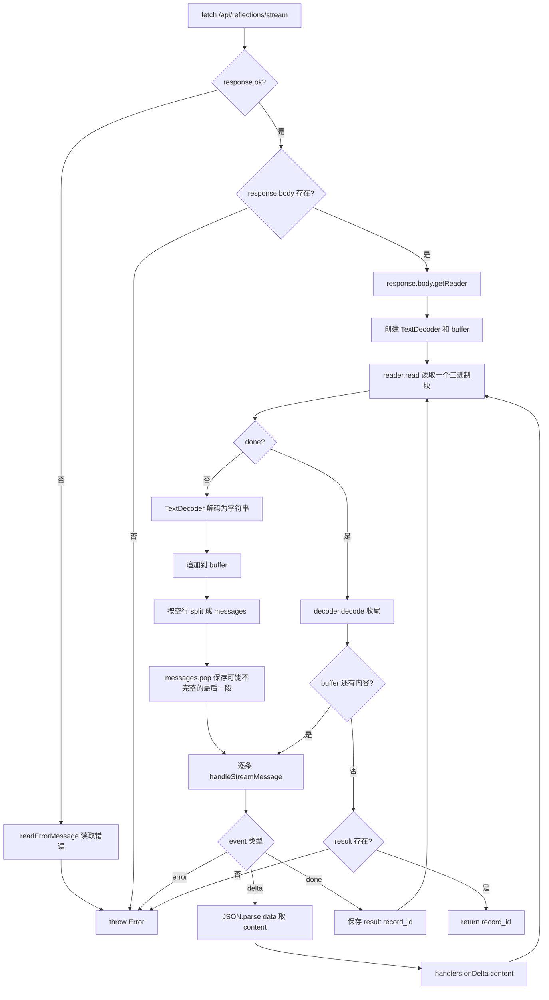

# 阶段 5 流式输出流程图

## 总链路

## 前端读取流细节

## 关键理解

- 后端模型流和前端接口流不是同一个流，但后端把模型流转成了前端可读的 SSE 风格文本流。
- `delta` 用于实时展示内容，`done` 用于告诉前端保存完成，`error` 用于告诉前端生成失败。
- 前端不能对流式响应使用 `response.json()`，需要用 `response.body.getReader()` 一块一块读取。
- `buffer` 的作用是保存未完整到达的 SSE 事件，避免网络分块导致解析错误。
