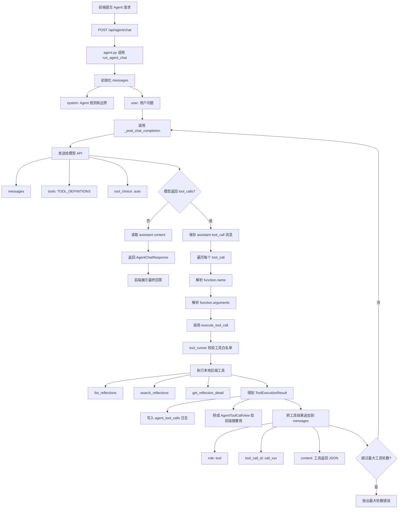

# 阶段 7 设计：Agent / Tool Calling 工作流

## 目标

阶段 7 的目标是让 AI 从“生成一段回答”升级为“能根据用户意图调用后端工具完成任务”。

当前项目已经具备：

- 前端表单和历史记录
- 后端 CRUD 和 SQLite 存储
- LLM 非流式与流式生成
- RAG 知识库检索增强
- 参考资料展示

阶段 7 要补上的核心能力是：

```text
用户自然语言请求
-> AI 判断是否需要工具
-> 后端执行工具
-> AI 基于工具结果组织最终回答
-> 前端展示回答和工具调用过程
```

这一步是从 LLM 应用走向 Agent 应用的关键过渡。

## 示例场景

用户输入：

```text
帮我回顾最近几次焦虑相关的复盘，整理一个本周行动计划。
```

系统执行流程：

```text
Agent 理解用户意图
-> 调用 search_reflections 查询焦虑相关历史记录
-> 调用 get_reflection_detail 获取关键记录详情
-> 结合 RAG 知识库和历史复盘内容
-> 生成低风险、可执行的行动建议
-> 展示本次调用了哪些工具
```

## MVP 范围

第一版只做单 Agent + 原生 Tool Calling + 少量工具 + 可观察日志。

包含：

- 新增 Agent 请求接口。
- 定义后端工具白名单。
- 使用 OpenAI-compatible `tools` / `tool_choice` 让模型决定是否调用工具。
- 后端校验工具名和参数。
- 后端执行工具并把结果交回模型。
- 返回最终回答。
- 保存工具调用日志。
- 前端展示最终回答和工具调用摘要。

不包含：

- 多 Agent 协作。
- LangGraph 深度工作流。
- MCP 接入。
- 自主无限循环。
- 自动删除或修改用户数据。
- 长期记忆系统。
- 外部网页搜索。
- 复杂评测平台。

这些能力后续可以放到进阶阶段或生产化阶段。

## 实现前置确认

阶段 7 实现前需要先确认当前模型服务是否支持原生 Tool Calling。

当前探测结论：

```text
LLM_BASE_URL 支持 OpenAI-compatible Tool Calling
status=200
finish_reason=tool_calls
message 中包含 tool_calls
```

探测请求使用了最小工具：

```text
get_current_time({"timezone":"Asia/Shanghai"})
```

模型返回了标准工具调用结构：

```json
{
  "type": "function",
  "function": {
    "name": "get_current_time",
    "arguments": "{\"timezone\":\"Asia/Shanghai\"}"
  }
}
```

因此阶段 7 正式实现路线采用：

```text
原生 Tool Calling 优先
JSON Action Protocol 仅作为兜底方案
```

## 为什么这一阶段不直接上 LangGraph

LangGraph 适合更复杂的多节点状态流，例如规划、执行、反思、人工确认、多工具循环。

当前项目更适合先基于原生 Tool Calling 手写一个最小 Agent Loop，因为学习价值和工程边界更清晰：

- 能看懂 Tool Calling 的底层流程。
- 能理解模型只是“提出工具调用请求”，真正执行工具的是后端。
- 能清楚看到参数校验、权限边界和日志记录。
- 能贴近 OpenAI-compatible API 的实际工程用法。
- 避免一开始被框架抽象挡住核心原理。

等单 Agent Loop 理解后，再引入 LangGraph 会更合理。

## 技术方案

### 后端目录

建议新增：

```text
backend/app/agent/
├── __init__.py
├── schemas.py          # Agent 请求、响应、工具调用数据结构
├── tools.py            # 工具函数定义
├── tool_runner.py      # 工具白名单、参数校验和执行入口
└── agent_client.py     # Agent Loop 和 LLM Tool Calling 调用

backend/app/routers/
└── agent.py            # Agent API 路由
```

现有文件需要配合修改：

```text
backend/app/models.py   # 增加工具调用日志表
backend/app/main.py     # 注册 agent 路由
frontend/app/page.tsx   # 增加轻量 Agent 区域
frontend/app/lib/api.ts # 增加 Agent API 请求方法
frontend/app/lib/types.ts
```

### 前端入口

第一版不做完整聊天系统，只在首页增加一个轻量模块：

```text
AI 行动助手
[输入框：你想让 AI 帮你回顾什么？]
[提交按钮]

回答：
...

本次使用的工具：
- search_reflections：查询到 3 条相关记录
- get_reflection_detail：读取了第 12 条复盘详情
```

这样可以先验证 Agent 能力，不把阶段重点转移到聊天 UI。

## 工具设计

第一版优先使用只读工具，避免高风险写操作。

### 1. `list_reflections`

用途：查询当前 `session_id` 下最近的复盘记录。

输入：

```json
{
  "limit": 5
}
```

输出：

```json
[
  {
    "id": 1,
    "event_summary": "和同事沟通不顺",
    "emotion_tags": ["焦虑", "委屈"],
    "emotion_intensity": 7,
    "created_at": "2026-07-14T10:00:00Z"
  }
]
```

注意：`session_id` 不由模型传入，而是由后端从接口请求中注入，避免模型越权查询其他用户数据。

### 2. `search_reflections`

用途：按关键词、情绪标签、关注领域搜索当前 `session_id` 的历史复盘。

输入：

```json
{
  "query": "焦虑",
  "limit": 5
}
```

输出：

```json
[
  {
    "id": 3,
    "event_summary": "直播前担心表现不好",
    "matched_reason": "emotion_tags 包含 焦虑"
  }
]
```

第一版可以先做数据库字段的简单关键词匹配，不做向量化历史记忆。

### 3. `get_reflection_detail`

用途：读取某条复盘详情，包括用户原始输入、AI 报告和 RAG 参考资料。

输入：

```json
{
  "record_id": 3
}
```

输出：

```json
{
  "id": 3,
  "event_text": "直播前担心表现不好",
  "emotion_tags": ["焦虑"],
  "ai_report": "...",
  "references": [
    {
      "source_title": "龙门心智_xxx",
      "score": 0.72
    }
  ]
}
```

后端必须同时校验 `record_id` 和当前 `session_id`。

### 4. `build_action_plan`

用途：根据已经检索到的复盘摘要，整理低风险行动计划。

输入：

```json
{
  "goal": "本周减少拖延",
  "context": "最近几条复盘摘要..."
}
```

输出：

```json
{
  "steps": [
    "每天开始前写下 1 个最小行动",
    "直播前做 3 分钟呼吸稳定",
    "结束后记录一个完成证据"
  ]
}
```

第一版这个工具可以是规则化整理，也可以由最终 Agent 回答完成。重点不是计划本身，而是建立工具调用链路。

## 暂不开放的工具

第一版不开放这些写操作：

- 删除复盘。
- 修改反馈。
- 新建复盘。
- 修改知识库。
- 调用外部网络。

原因：

- Agent 可能误判用户意图。
- 写操作需要用户确认。
- 删除、覆盖、外部调用都属于更高风险能力。

后续如果加入写操作，必须引入 Human-in-the-loop：

```text
AI 提议操作
-> 前端展示待确认动作
-> 用户点击确认
-> 后端执行写操作
```

## Agent 接口

新增接口：

```text
POST /api/agent/chat
```

请求：

```json
{
  "session_id": "string",
  "message": "帮我总结最近几次焦虑复盘，并给我一个行动计划"
}
```

响应：

```json
{
  "answer": "string",
  "tool_calls": [
    {
      "tool_name": "search_reflections",
      "arguments": {
        "query": "焦虑",
        "limit": 5
      },
      "result_summary": "查询到 3 条相关复盘",
      "status": "success"
    }
  ]
}
```

第一版先做非流式响应。原因：

- 阶段 5 已经学习过 SSE。
- Tool Calling 的重点是工具选择、工具执行和 Agent Loop。
- 非流式更容易调试工具调用过程。

如果第一版稳定，再升级为流式 Agent。

## Tool Calling 兼容策略

不同模型服务商对 Tool Calling 的支持不完全一致。

### 当前采用方案：原生 Tool Calling

```text
使用 OpenAI-compatible tools / tool_choice
```

后端请求模型时传入：

- `tools`：描述可用工具名称、说明、参数 JSON Schema。
- `tool_choice`：第一版使用 `auto`，让模型自行判断是否需要工具。
- `messages`：包含系统提示词、用户请求、工具执行结果。

模型如果决定调用工具，会返回：

```json
{
  "role": "assistant",
  "tool_calls": [
    {
      "id": "call_xxx",
      "type": "function",
      "function": {
        "name": "search_reflections",
        "arguments": "{\"query\":\"焦虑\",\"limit\":5}"
      }
    }
  ]
}
```

后端执行工具后，需要把工具结果以 `role=tool` 的消息追加回对话：

```json
{
  "role": "tool",
  "tool_call_id": "call_xxx",
  "content": "{\"records\":[...]}"
}
```

然后再次调用模型，让模型基于工具结果生成最终回答。

### 兜底方案：JSON Action Protocol

如果以后更换的模型服务商不支持原生 `tools`，可以退回到 Prompt 约束模型输出 JSON 工具调用意图：

```text
使用 Prompt 约束模型输出 JSON 工具调用意图
后端解析 JSON 并执行工具
```

```json
{
  "type": "tool_call",
  "tool_name": "search_reflections",
  "arguments": {
    "query": "焦虑",
    "limit": 5
  }
}
```

后端仍然负责：

- 校验 JSON 格式。
- 校验工具名是否在白名单。
- 校验参数类型。
- 注入当前 `session_id`。
- 执行工具。
- 把工具结果交回模型生成最终回答。

兜底方案只作为兼容策略，不作为当前阶段的主实现。

## Agent Loop

第一版建议最多允许 3 轮工具调用，避免无限循环。

流程：

```text
1. 前端提交 message + session_id
2. 后端构造系统提示词、用户消息、工具 schema
3. 调用 LLM
4. 如果 LLM 返回普通回答，直接结束
5. 如果 LLM 返回 tool_calls，后端逐个校验工具名和参数
6. 后端执行工具白名单中的函数
7. 后端把工具结果按 role=tool 追加到 messages
8. 再次调用 LLM
9. 重复直到得到最终回答或达到最大工具调用次数
10. 保存 tool_calls 日志
11. 返回 answer + tool_calls 给前端
```


### Agent Client 流程图

`backend/app/agent/agent_client.py` 是模型 API 和本地工具执行器之间的调度器。



简化理解：

```text
模型 API 负责判断是否要调用工具
FastAPI 后端负责真正执行工具
agent_client.py 负责在两者之间调度
```

## 数据表设计

新增工具调用日志表：

```text
agent_tool_calls
```

建议字段：

```text
id
session_id
tool_name
arguments_json
result_summary
status
error_message
created_at
```

第一版可以不单独建 `agent_runs` 表，先用 `session_id` 和 `created_at` 追踪。后续如果要做完整对话历史，再增加：

```text
agent_runs
agent_messages
```

## 安全边界

必须遵守：

- API Key 只存在后端 `.env`。
- Agent 只能访问当前 `session_id` 的数据。
- 模型不能直接决定调用任意 Python 函数。
- 所有工具必须在后端白名单中注册。
- 工具参数必须做类型校验。
- 工具结果要截断，避免把过长历史全部塞回模型。
- 第一版不允许 Agent 自动删除或修改数据。
- 心理健康场景必须保留免责声明和危机提示边界。

## 错误处理

需要覆盖：

- 模型服务不可用。
- 模型返回非法工具名。
- 模型返回非法参数。
- 工具执行失败。
- 工具调用次数超过限制。
- 当前 `session_id` 没有历史记录。

前端展示原则：

- 用户看到可理解错误。
- 开发者能从后端日志或工具调用摘要定位问题。
- 不暴露 API Key、完整请求头或敏感环境变量。

## 验收标准

阶段 7 完成需要满足：

- 前端可以输入自然语言 Agent 请求。
- 后端至少支持 2 个工具。
- Agent 能通过原生 `tool_calls` 根据用户问题选择并调用工具。
- 工具调用只能访问当前 `session_id` 的数据。
- 前端能展示最终回答。
- 前端能展示本次调用过哪些工具。
- 后端能保存工具调用日志。
- 工具调用失败时有明确错误提示。
- 没有相关历史记录时，Agent 能正常降级回答。

## 建议测试用例

### 用例 1：查询历史复盘

```text
帮我看看最近有哪些复盘记录，按时间列出来。
```

预期：

- 调用 `list_reflections`。
- 返回最近记录摘要。
- 前端显示工具调用摘要。

### 用例 2：搜索焦虑相关记录

```text
帮我找出最近和焦虑有关的复盘，并总结共同触发点。
```

预期：

- 调用 `search_reflections`。
- 必要时调用 `get_reflection_detail`。
- 最终回答包含共同触发点和温和建议。

### 用例 3：生成行动计划

```text
基于我最近的复盘，给我一个本周可执行的三步行动计划。
```

预期：

- 查询历史记录。
- 整理行动计划。
- 不自动写入数据库。

### 用例 4：无历史记录降级

```text
帮我总结最近的复盘。
```

预期：

- 工具返回空列表。
- Agent 说明当前没有历史记录，并建议先创建复盘。

## 学习重点

阶段 7 重点理解：

- Agent 和普通 LLM 调用的区别。
- Tool Calling 是什么。
- OpenAI-compatible `tools` / `tool_choice` / `tool_calls` 的数据结构。
- `role=tool` 消息为什么要追加回模型上下文。
- 工具 schema 如何描述。
- 模型为什么不能直接执行工具。
- 后端工具白名单的意义。
- Agent Loop 的执行过程。
- 为什么需要最大工具调用次数。
- 为什么写操作需要 Human-in-the-loop。
- 工具调用日志如何帮助排查问题。
- 为什么先手写单 Agent，再考虑 LangGraph。
