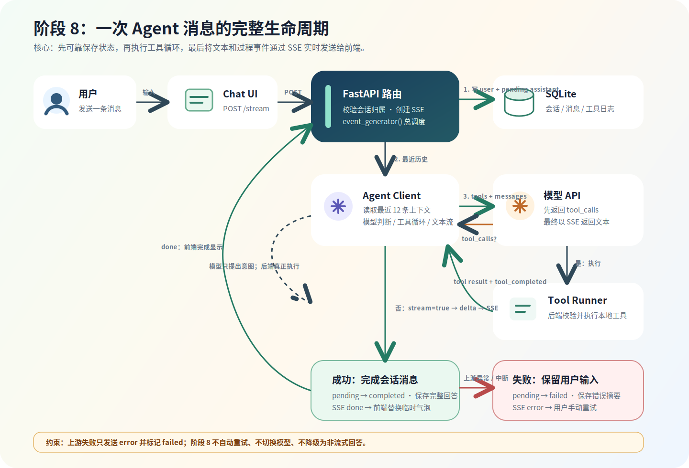

# 阶段 8 设计：有状态流式 Agent

## 目标

阶段 7 已完成原生 Tool Calling：用户发送一个问题，模型可以决定调用只读工具，后端执行工具后返回最终回答。

这一阶段将它升级为一个可连续使用的 Agent：

```text
用户发送消息
-> 后端保存用户消息
-> 读取当前会话最近的历史消息
-> Agent 判断并调用工具
-> SSE 推送工具过程和回答文本
-> 保存完整助手回答与工具日志
```

阶段 8 覆盖：

- 多轮对话。
- 基础上下文管理。
- 短期会话记忆。
- Agent 流式输出。
- 工具执行过程可见。
- 基础调用状态记录。

## 一次消息的生命周期图



图中的关键分层：

```text
conversation_service：会话、消息与上下文
agent_client：模型调用、工具循环与文本片段
agent.py 路由：SSE 封装、完成/失败后的最终写入
```

## 范围与边界

### 本阶段包含

- 新增 Agent 会话和消息持久化。
- 刷新页面后可恢复当前匿名用户的会话列表和消息历史。
- 每次请求将当前会话最近若干条已完成消息发送给模型。
- 将 Agent 最终回答改为 SSE 流式返回。
- 推送工具开始、工具完成、文本增量、完成和错误事件。
- 保存模型名、耗时和消息处理状态。
- 上游失败后保留用户已输入的文本，并允许用户手动再次提交。

### 本阶段不包含

- 跨会话长期记忆、用户画像或偏好推断。
- 自动摘要旧消息；只使用最近消息作为短期记忆。
- LangChain 或 LangGraph；它们分别放在阶段 9、阶段 10。
- 自动重试、模型切换、备用模型或功能降级。
- 写操作工具与 Human-in-the-loop；放在阶段 10。
- 用户登录、跨设备同步和完整隐私管理；当前仍使用匿名 `session_id`。

## 上游异常策略

当前模型服务通过反代访问，可能出现临时 503、认证不可用或流式连接中断。

本阶段约束如下：

```text
上游异常
-> 停止当前 SSE 流
-> 返回明确 error 事件
-> 将本次助手消息标记为 failed
-> 前端保留用户输入并展示手动重试入口
```

不会自动执行：

- 重试请求。
- 切换模型。
- 切换到非流式接口。
- 用模板文本伪造成功回答。

未来如需任何降级策略，必须先由用户确认后再设计和实现。

## 数据模型

### 现有 `session_id` 的含义

`session_id` 是前端保存在浏览器 `localStorage` 的匿名用户标识。它说明“当前是哪位未登录用户”，不是“一次聊天”。

### `agent_conversations`

一条记录代表一个具体 Agent 会话。

| 字段 | 含义 |
| --- | --- |
| `id` | UUID 字符串，前端用于定位会话 |
| `session_id` | 匿名用户标识，用于隔离不同用户数据 |
| `title` | 由首条用户消息截取的简短标题 |
| `created_at` | 创建时间（UTC） |
| `updated_at` | 最后一次消息完成或失败的时间（UTC） |

一个 `session_id` 可拥有多个 `agent_conversations`。

### `agent_messages`

一条记录代表会话中的一条用户消息或助手消息。

| 字段 | 含义 |
| --- | --- |
| `id` | 自增主键 |
| `conversation_id` | 所属会话 |
| `role` | `user` 或 `assistant` |
| `content` | 用户原始问题或完整助手回答 |
| `status` | `completed`、`pending`、`failed` |
| `model` | 本次助手消息使用的模型；用户消息为空 |
| `duration_ms` | 本次助手处理耗时；用户消息为空 |
| `error_message` | 失败时面向用户的错误摘要；成功时为空 |
| `created_at` | 创建时间（UTC） |

发起请求时，后端先保存用户消息，同时创建一条 `pending` 的助手消息。这样即使流式请求中断，也能准确记录发生了什么。

### 工具调用日志关联

现有 `agent_tool_calls` 增加：

| 字段 | 含义 |
| --- | --- |
| `conversation_id` | 本次工具调用所属会话 |
| `assistant_message_id` | 触发本次调用的助手消息 |

工具日志继续保存工具名、参数摘要、执行结果摘要、状态和错误信息。Agent 历史页可据此显示“这条回答使用了哪些工具”。

## 上下文管理

每次用户发送新消息时，后端按以下顺序构造模型 `messages`：

```text
System Prompt
-> 当前会话最近 N 条 completed 的 user / assistant 消息
-> 当前新用户消息
```

第一版固定读取最近 12 条已完成消息。`pending` 和 `failed` 消息不进入模型上下文，避免将半截回答或错误文本再次交给模型。

工具调用期间的 `role=tool` 消息仅存在于本轮 Agent Loop 中，用于把工具结果交回模型；最终会持久化为工具日志，而不是作为普通聊天消息重复塞入后续上下文。

这是一种短期会话记忆。聊天历史过长时，较早消息会自然不再进入本轮上下文。阶段 10 再通过 LangGraph 加入摘要记忆与长期记忆。

## API 设计

### 创建会话

```text
POST /api/agent/conversations
```

请求：

```json
{
  "session_id": "anonymous-user-id"
}
```

响应：

```json
{
  "id": "conversation-uuid",
  "title": "新对话",
  "created_at": "2026-07-17T08:00:00Z",
  "updated_at": "2026-07-17T08:00:00Z"
}
```

前端在用户首次提交时懒创建会话，避免产生空会话。

### 查询会话列表

```text
GET /api/agent/conversations?session_id=...
```

按 `updated_at` 倒序返回当前匿名用户的会话摘要。

### 查询会话消息

```text
GET /api/agent/conversations/{conversation_id}/messages?session_id=...
```

后端必须同时校验 `conversation_id` 与 `session_id`，防止通过猜测 UUID 查看其他匿名用户的会话。

### 流式发送消息

```text
POST /api/agent/conversations/{conversation_id}/stream
```

请求：

```json
{
  "session_id": "anonymous-user-id",
  "message": "帮我回顾最近几次焦虑相关的复盘。"
}
```

响应类型：

```text
Content-Type: text/event-stream
```

## SSE 事件协议

每个事件由 `event:` 和 JSON 格式 `data:` 组成，前端沿用阶段 5 的流读取和解析方式。

| 事件名 | 作用 | `data` 示例 |
| --- | --- | --- |
| `conversation` | 告知前端当前会话与占位助手消息 | `{"conversation_id":"...","assistant_message_id":12}` |
| `tool_started` | 模型决定调用工具，后端即将执行 | `{"tool_name":"search_reflections","arguments":{"query":"焦虑"}}` |
| `tool_completed` | 工具执行结束 | `{"tool_name":"search_reflections","result_summary":"查询到 3 条记录","status":"success"}` |
| `delta` | 最终回答的增量文本 | `{"content":"你最近的焦虑"}` |
| `done` | 流结束，返回已保存的助手消息和工具摘要 | `{"message":{...},"tool_calls":[...]}` |
| `error` | 上游或处理异常 | `{"message":"Agent API request failed with status 503..."}` |

`tool_started` 和 `tool_completed` 不代表模型自行执行了工具。模型只返回工具调用意图，真正执行工具的仍是 FastAPI 后端。

## 后端实现设计

### 模块调整

```text
backend/app/
├── models.py                    # 新增会话、消息字段；扩展工具日志关联
├── agent/
│   ├── agent_client.py           # 从一次性返回改为异步事件流
│   ├── conversation_service.py   # 会话归属校验、消息创建/查询/更新
│   └── schemas.py                # 会话、消息、SSE 结果的数据模型
└── routers/
    └── agent.py                  # 会话 CRUD 与 stream 路由
```

### Agent 流式循环

`agent_client.py` 改为异步生成器，其职责是产生业务事件，而不是直接写 SSE 文本：

```text
请求模型（非流式 Tool Calling 判定）
-> 若模型返回 tool_calls：yield tool_started
-> 后端执行工具并记录日志：yield tool_completed
-> 将工具结果回传模型，继续循环
-> 若模型不再要求工具：以 stream=true 请求最终回答
-> 每个文本片段 yield delta
-> 完整回答交由路由/服务层保存，再 yield done
```

这样将“模型与工具协议”与“HTTP SSE 格式”分离，阶段 9 引入 LangChain 时也更容易替换模型调用层。

工具判定轮次继续沿用最大轮次限制，防止 Agent 无限循环。达到上限时返回明确错误，不自动降级。

### 数据写入时机

```text
校验会话归属
-> 保存 user 消息
-> 创建 pending assistant 消息
-> 执行 Agent 流
-> 成功：更新 assistant content/status/duration/model，更新会话时间
-> 失败：更新 assistant status/error_message，更新会话时间，发送 error 事件
```

如果浏览器主动断开连接，后端应结束流式读取并将占位助手消息标记为 `failed` 或 `cancelled`。第一版使用 `failed`，不额外引入 `cancelled` 状态和用户中止操作。

## 前端交互设计

首页 Agent 区域升级为简洁聊天界面：

```text
[会话列表]
  - 最近一次对话
  - 新建对话

[当前会话消息]
  用户：...
  Agent：逐步生成的回答
  工具：search_reflections · 查询到 3 条记录

[输入框] [发送]
```

前端状态需要区分：

- 当前会话 ID。
- 历史消息列表。
- 正在流式生成的临时助手消息。
- 当前已发生的工具事件。
- `isStreaming`、错误信息和待发送输入。

请求失败时，不清空 textarea 中的输入内容；前端仅显示错误和“重新发送”按钮。用户显式再次提交时才创建新的用户消息，避免后端自动重复执行请求。

## 验证方案

### 后端接口

- 创建会话后，可通过列表接口查到该会话。
- 发送第一条消息后，数据库中保存一条 `user` 和一条 `assistant` 消息。
- 再发送“你刚才提到的第一个建议具体怎么做？”时，模型能理解“刚才”指向上条回答。
- 请求包含历史复盘问题时，事件顺序为 `tool_started -> tool_completed -> delta -> done`。
- 上游返回 503 时，SSE 返回 `error`，助手消息状态为 `failed`，不发生自动重试或模型切换。

### 前端联调

- 刷新页面后，当前匿名用户的会话与消息能恢复。
- Agent 回答逐字或逐片段出现。
- 工具调用状态在回答生成前或生成中可见。
- 失败后输入内容仍保留；用户可点击重新发送。
- 开启浏览器 Network 面板可看到 `text/event-stream` 和对应事件。

## 完成后的学习检查点

- 能区分 `session_id`、`conversation_id`、`message_id` 的职责。
- 能解释多轮对话、上下文管理与短期记忆的关系。
- 能解释为什么会话和消息需要由后端数据库保存。
- 能解释 Agent 的工具事件和最终文本为什么都适合通过 SSE 推送。
- 能解释为什么上游 400、401、503 不应盲目自动重试。
- 能解释本阶段为什么仍不引入 LangChain / LangGraph。
